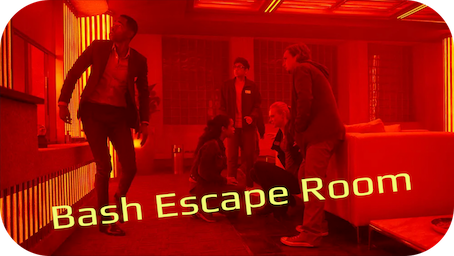

# Bash EscapeRoom Labs

<!-- header start -->
<div markdown style="text-align: center;border-radius: 20px;">

</div>

---


!!! success "Decryption Tip"
    If the content doesn't appear after entering the password in the selected room, please refresh the page (F5 or Ctrl+R).


<div class="grid cards" markdown style="text-align: center;border-radius: 20px;">

- 
  ```sh
  docker run -it nirgeier/escape-room-bash
  ```

- {: .height-64px}<br/><br/>
  [https://killercoda.com/codewizard/scenario/BashEscapeRoom](https://killercoda.com/codewizard/scenario/BashEscapeRoom)

</div>

---

## Room Links

- [Rooms  Room 01](./rooms/Room-01.md)

---

## Intro

- **The inspiration comes from [github.com/andrey-zap/escapeRoomLinux](https://github.com/andrey-zap/escapeRoomLinux)**
- This tutorial is for teaching bash scripting through puzzles designed as escape rooms.
- Each room is packaged in its own folder and includes the files, scripts, and assets required to play.
- Every room folder includes a `README` that describes the room's objectives, hints, rules, and how to verify the solution.
- The Bash Escape Room is a series of bash puzzles (Escape-rooms, rooms similar to the real-life attractions of Escape rooms).
- The Bash Escape Room puzzles are designed to teach the players Bash and Linux skills & features.
- The inspiration for this project is the real-life Escape rooms.

---

## Pre-Requirements

- This tutorial will test your `Linux` and `Bash` skills.
- You should be familiar with the following topics:
  - Basic Linux commands
  - Linux File system navigation
  - Linux Text processing tools (like `grep`, `sed`, `awk`)
  - Linux Shell scripting basics
  - Linux Understanding of environment variables
  - Basic knowledge of `Docker` (if you choose to run it with Docker)
  - Basic knowledge of `Vim`

---

### Usage

There are several ways to run the Bash Escape Room. Choose the method that works best for your environment:

=== "{:. height-16px} Method 1: Killercoda  (Recommended)"

    Play directly in your browser without any local installation:

    🌐 **[Launch on Killercoda](https://killercoda.com/codewizard/scenario/BashEscapeRoom)**

    **Benefits:**

    - No installation required
    - Pre-configured environment
    - Works on any device with a web browser
    - All tools pre-installed

=== "🐳 Method 2: Docker"

    The easiest and fastest way to get started:

    ```bash
    docker run -it devopslive/escape-room-bash
    ```

    **Prerequisites:**

    - Docker installed on your system
    - No additional setup required
    
=== "💻 Method 3: Local Installation"

    For those who prefer to run it directly on their machine:

    ```bash
    # Clone the repository
    git clone https://github.com/nirgeier/Bash-EscapeRoom.git
    cd Bash-EscapeRoom/Labs
    # Start the first room
    cd rooms/room-01
    cat README.md
    ```
    **Prerequisites:**

    - A Unix-like operating system (Linux, macOS, or Windows with WSL)
    - Bash shell
    - Basic command-line tools (like `grep`, `sed`, `awk`, `vim`
    - Optional: Docker for isolated environments
  
=== "🛠️ Method 4: Build from Source"

    For developers who want to customize or contribute:

    ```bash
    # Clone the repository
    git clone https://github.com/nirgeier/Bash-EscapeRoom.git
    cd Bash-EscapeRoom

    # Build and run with Docker
    docker build -t bash-escape-room .
    docker run -it bash-escape-room
    ```

    **Prerequisites:**

    - Git
    - Docker
    - Basic knowledge of Docker builds

---

Good Luck!
