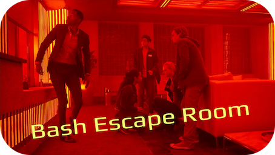

# Bash EscapeRoom Labs

<!-- header start -->
<div markdown style="text-align: center;border-radius: 20px;">

</div>

---


!!! success "Decryption Tip"
If the content doesn't appear after entering the password in the selected room, please refresh the page (F5 or Ctrl+R).

<div class="grid cards" markdown style="text-align: center;border-radius: 20px;">

- 

  ```sh
  docker  run -it --pull=always \
          ghcr.io/nirgeier/bash-escaperoom:latest
  ```

- {: .height-64px}<br/><br/>
  [https://killercoda.com/codewizard/scenario/BashEscapeRoom](https://killercoda.com/codewizard/scenario/BashEscapeRoom)

</div>

---

## Room Links

| Lab ID | Lab Title | Key Commands |
| ------ | --------- | ------------ |
| [Lab 01](./rooms/Room-01.md) | The Lost Expedition | `find`, `cat`, `sort`, `xargs` |
| [Lab 02](./rooms/Room-02.md) | The Broken Radio | `grep`, `grep -c`, `wc -l` |
| [Lab 03](./rooms/Room-03.md) | The Time Capsule | `tac`, `rev`, `head`, `tail`, `wc` |
| [Lab 04](./rooms/Room-04.md) | The Spy Cipher | `sed`, `sed 's/old/new/g'` |
| [Lab 05](./rooms/Room-05.md) | The Decoder Ring | `base64`, `tr` (ROT13), `rev` |
| [Lab 06](./rooms/Room-06.md) | The Duplicate Detective | `sort`, `uniq`, `comm`, `diff` |
| [Lab 07](./rooms/Room-07.md) | The Permission Maze | `chmod`, `stat`, `ls -l` |
| [Lab 08](./rooms/Room-08.md) | The Environment Lab | `export`, `env`, `source`, `alias` |
| [Lab 09](./rooms/Room-09.md) | The Ghost Process | `ps`, `kill`, `jobs`, `bg`, `fg` |
| [Lab 10](./rooms/Room-10.md) | The Data Mine | `awk`, `awk -F`, `NR`, `NF` |
| [Lab 11](./rooms/Room-11.md) | The Nested Archive | `base64 -d`, `gzip`, `tar`, `file` |
| [Lab 12](./rooms/Room-12.md) | The Grand Pipeline | `cut`, `tr`, pipes |
| [Lab 13](./rooms/Room-13.md) | The Mirror Maze | `ln -s`, `readlink`, `readlink -f` |
| [Lab 14](./rooms/Room-14.md) | The Web Crawler | `curl`, `curl -H`, `curl -s` |
| [Lab 15](./rooms/Room-15.md) | The JSON Vault | `jq`, `jq -r`, `select()` |
| [Lab 16](./rooms/Room-16.md) | The Space Station | `df -h`, `du -sh`, `sort -rh` |
| [Lab 17](./rooms/Room-17.md) | The Clockwork Fortress | `crontab -l`, cron expressions |
| [Lab 18](./rooms/Room-18.md) | The Twin Blueprints | `diff`, `diff -u`, `patch` |
| [Lab 19](./rooms/Room-19.md) | The Integrity Check | `md5sum`, `sha256sum`, `sha256sum -c` |
| [Lab 20](./rooms/Room-20.md) | The Hex Dungeon | `xxd`, `xxd -r`, `od`, `hexdump` |
| [Lab 21](./rooms/Room-21.md) | The Binary Library | `strings`, `strings -n` |
| [Lab 22](./rooms/Room-22.md) | The Calculator Cave | `bc`, `expr`, `$(( ))` |
| [Lab 23](./rooms/Room-23.md) | The Time Machine | `date`, `date -d @TIMESTAMP` |
| [Lab 24](./rooms/Room-24.md) | The Formatter's Workshop | `printf`, `echo -e` |
| [Lab 25](./rooms/Room-25.md) | The Signal Crossroads | `tee`, `tee -a`, `paste` |
| [Lab 26](./rooms/Room-26.md) | The Variable Vault | `${var##*/}`, `${var%/*}`, parameter expansion |
| [Lab 27](./rooms/Room-27.md) | The Array Arsenal | `arr=()`, `${arr[@]}`, `mapfile` |
| [Lab 28](./rooms/Room-28.md) | The Loop Labyrinth | `for` loops, `$(( ))` |
| [Lab 29](./rooms/Room-29.md) | The Endless Corridor | `while read`, `while IFS= read -r` |
| [Lab 30](./rooms/Room-30.md) | The Fork in the Road | `if/elif/else`, `[ ]`, `[[ ]]` |
| [Lab 31](./rooms/Room-31.md) | The Decision Chamber | `case ... in`, pattern matching |
| [Lab 32](./rooms/Room-32.md) | The Function Factory | `func(){}`, `local`, `return` |
| [Lab 33](./rooms/Room-33.md) | The Argument Decoder | `getopts`, `$OPTARG` |
| [Lab 34](./rooms/Room-34.md) | The Ancient Scroll | `<< 'EOF'`, here-documents |
| [Lab 35](./rooms/Room-35.md) | The Nested Worlds | `$()`, `<(cmd)`, process substitution |
| [Lab 36](./rooms/Room-36.md) | The Signal Tower | `trap`, `kill -SIGUSR1` |
| [Lab 37](./rooms/Room-37.md) | The Interactive Gateway | `read`, `read -p`, `read -s` |
| [Lab 38](./rooms/Room-38.md) | The Time Bomb | `timeout`, `watch`, `sleep` |
| [Lab 39](./rooms/Room-39.md) | The Network Hub | `ss -tlnp`, `netstat -tlnp` |
| [Lab 40](./rooms/Room-40.md) | The DNS Oracle | `dig`, `host`, `nslookup` |
| [Lab 41](./rooms/Room-41.md) | The Netcat Tunnel | `nc`, `nc -l` |
| [Lab 42](./rooms/Room-42.md) | The Open Files Archive | `lsof`, `lsof -p`, `lsof -i` |
| [Lab 43](./rooms/Room-43.md) | The System Call Observatory | `strace`, `ltrace` |
| [Lab 44](./rooms/Room-44.md) | The Mirror Sync | `rsync -av`, `rsync --delete` |
| [Lab 45](./rooms/Room-45.md) | The Cryptographer's Den | `openssl enc -d`, `openssl dgst` |
| [Lab 46](./rooms/Room-46.md) | The Vi Vortex | `vim`, `NG`, `/pattern` |
| [Lab 47](./rooms/Room-47.md) | The Remote Gateway | `ssh-keygen`, `ssh -i`, `scp` |
| [Lab 48](./rooms/Room-48.md) | The Version Vault | `git log`, `git show HASH:file` |
| [Lab 49](./rooms/Room-49.md) | The Grand Pipeline II | `awk`, `sort`, `uniq -c`, `sort -rn` |
| [Lab 50](./rooms/Room-50.md) | The Master Terminal | `find`, `base64`, `grep`, `bc`, `sha256sum` |
| [Room 51](rooms/Room-51.md) | 🔧 The Command Assembler | `xargs`, `xargs -I{}`, `xargs -P`, `xargs -0`, `find \| xargs` |
| [Room 52](rooms/Room-52.md) | 🏛️ The Ownership Vault | `chown`, `chgrp`, `umask`, `id`, `groups`, `stat` |
| [Room 53](rooms/Room-53.md) | 📡 The Network Probe | `ping`, `traceroute`, `tracepath`, `wget`, `wget -O -` |
| [Room 54](rooms/Room-54.md) | 📊 The System Monitor | `top`, `free`, `uptime`, `vmstat`, `/proc/meminfo`, `nproc` |
| [Room 55](rooms/Room-55.md) | 🔍 The System Inspector | `uname`, `hostname`, `whoami`, `id`, `who`, `w`, `lscpu` |
| [Room 56](rooms/Room-56.md) | ⚙️ The Process Controller | `pgrep`, `pkill`, `nohup`, `nice`, `renice`, `killall` |
| [Lab 100](./rooms/Room-99.md) | Final Exam | All commands |

---

## Intro

- This tutorial is for teaching bash scripting through puzzles designed as escape rooms.
- Each room is packaged in its own folder and includes the files, scripts, and assets required to play.
- Every room folder includes a `README` that describes the room's objectives, hints, rules, and how to verify the solution.
- The Bash Escape Room is a series of bash puzzles (Escape-rooms, rooms similar to the real-life attractions of Escape rooms).
- The Bash Escape Room puzzles are designed to teach the players Bash and Linux skills & features.
- The inspiration for this project is the real-life Escape rooms.

---

## Pre-Requirements

- This tutorial will test your `Linux` and `Bash` skills.
- You should be familiar with the following topics:
  - Basic Linux commands
  - Linux File system navigation
  - Linux Text processing tools (like `grep`, `sed`, `awk`)
  - Linux Shell scripting basics
  - Linux Understanding of environment variables
  - Basic knowledge of `Docker` (if you choose to run it with Docker)
  - Basic knowledge of `Vim`

---

### Usage

There are several ways to run the Bash Escape Room. Choose the method that works best for your environment:

=== "{:. height-16px} Method 1: Killercoda (Recommended)"

    Play directly in your browser without any local installation:

    🌐 **[Launch on Killercoda](https://killercoda.com/codewizard/scenario/BashEscapeRoom)**

    **Benefits:**

    - No installation required
    - Pre-configured environment
    - Works on any device with a web browser
    - All tools pre-installed

=== "🐳 Method 2: Docker"

    The easiest and fastest way to get started:

    ```bash
    docker run -it --pull=always ghcr.io/nirgeier/bash-escaperoom:latest
    ```

    **Prerequisites:**

    - Docker installed on your system
    - No additional setup required

=== "💻 Method 3: Local Installation"

    For those who prefer to run it directly on their machine:

    ```bash
    # Clone the repository
    git clone https://github.com/nirgeier/Bash-EscapeRoom.git
    cd Bash-EscapeRoom/Labs
    # Start the first room
    cd rooms/room-01
    cat README.md
    ```
    **Prerequisites:**

    - A Unix-like operating system (Linux, macOS, or Windows with WSL)
    - Bash shell
    - Basic command-line tools (like `grep`, `sed`, `awk`, `vim`
    - Optional: Docker for isolated environments

=== "🛠️ Method 4: Build from Source"

    For developers who want to customize or contribute:

    ```bash
    # Clone the repository
    git clone https://github.com/nirgeier/Bash-EscapeRoom.git
    cd Bash-EscapeRoom

    # Build and run with Docker
    docker build -t bash-escape-room .
    docker run -it bash-escape-room
    ```

    **Prerequisites:**

    - Git
    - Docker
    - Basic knowledge of Docker builds

---

Good Luck!
