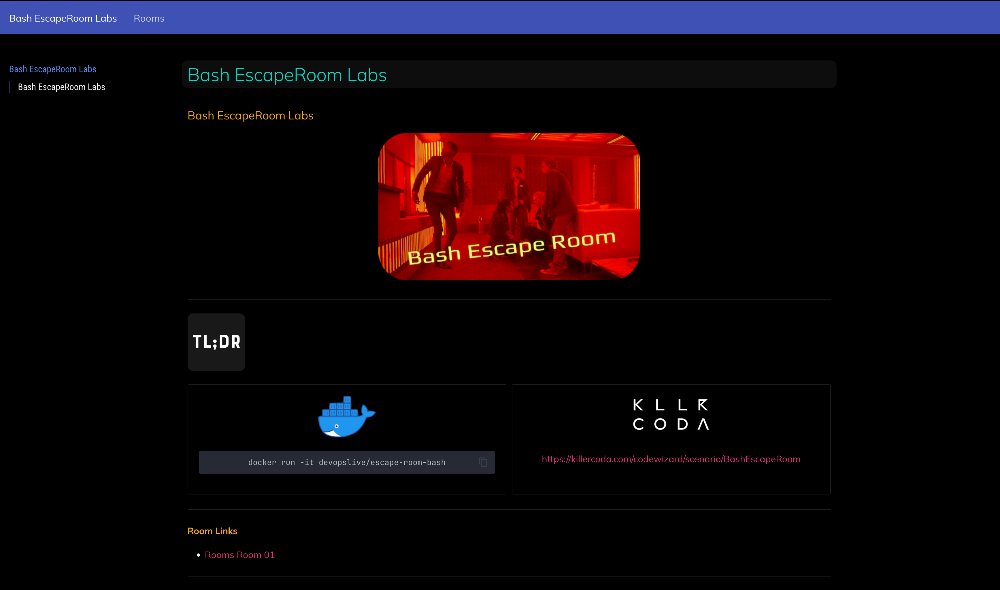

# Bash-EscapeRoom

- An interactive learning environment to master Bash and command-line skills through a series of challenges and puzzles.

## Overview

The Bash-EscapeRoom is designed to help users improve their proficiency with the Bash shell and command-line tools. Each room presents a unique challenge that requires problem-solving skills and knowledge of various Bash commands and scripting techniques.

## Getting Started

To get started with the Bash-EscapeRoom

[https://nirgeier.github.io/Bash-EscapeRoom](https://nirgeier.github.io/Bash-EscapeRoom)

