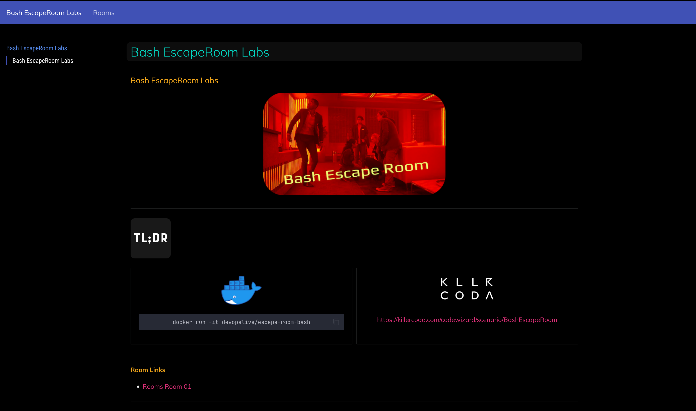

# Bash-EscapeRoom

- An interactive learning environment to master Bash and command-line skills through a series of challenges and puzzles.

## Overview

- The Bash-EscapeRoom is designed to help users improve their proficiency with the Bash shell and command-line tools. Each room presents a unique challenge that requires problem-solving skills and knowledge of various Bash commands and scripting techniques.

## Getting Started

To get started with the Bash-EscapeRoom

[https://nirgeier.github.io/Bash-EscapeRoom](https://nirgeier.github.io/Bash-EscapeRoom)

---

## Labs

| Lab ID                              | Lab Title                   | Key Commands                                     |
| ----------------------------------- | --------------------------- | ------------------------------------------------ |
| [Lab 01](./Labs/rooms/Room-01.md)   | The Lost Expedition         | `find`, `cat`, `sort`, `xargs`                   |
| [Lab 02](./Labs/rooms/Room-02.md)   | The Broken Radio            | `grep`, `grep -c`, `wc -l`                       |
| [Lab 03](./Labs/rooms/Room-03.md)   | The Time Capsule            | `tac`, `rev`, `head`, `tail`, `wc`               |
| [Lab 04](./Labs/rooms/Room-04.md)   | The Spy Cipher              | `sed`, `sed 's/old/new/g'`                       |
| [Lab 05](./Labs/rooms/Room-05.md)   | The Decoder Ring            | `base64`, `tr`, `rev`                    |
| [Lab 06](./Labs/rooms/Room-06.md)   | The Duplicate Detective     | `sort`, `uniq`, `comm`, `diff`                   |
| [Lab 07](./Labs/rooms/Room-07.md)   | The Permission Maze         | `chmod`, `stat`, `ls -l`                         |
| [Lab 08](./Labs/rooms/Room-08.md)   | The Environment Lab         | `export`, `env`, `source`, `alias`               |
| [Lab 09](./Labs/rooms/Room-09.md)   | The Ghost Process           | `ps`, `kill`, `jobs`, `bg`, `fg`                 |
| [Lab 10](./Labs/rooms/Room-10.md)   | The Data Mine               | `awk`, `awk -F`, `NR`, `NF`                      |
| [Lab 11](./Labs/rooms/Room-11.md)   | The Nested Archive          | `base64 -d`, `gzip`, `tar`, `file`               |
| [Lab 12](./Labs/rooms/Room-12.md)   | The Grand Pipeline          | `cut`, `tr`, pipes (`\|`)                        |
| [Lab 13](./Labs/rooms/Room-13.md)   | The Mirror Maze             | `ln -s`, `readlink`, `readlink -f`               |
| [Lab 14](./Labs/rooms/Room-14.md)   | The Web Crawler             | `curl`, `curl -H`, `curl -s`                     |
| [Lab 15](./Labs/rooms/Room-15.md)   | The JSON Vault              | `jq`, `jq -r`, `select()`                        |
| [Lab 16](./Labs/rooms/Room-16.md)   | The Space Station           | `df -h`, `du -sh`, `sort -rh`                    |
| [Lab 17](./Labs/rooms/Room-17.md)   | The Clockwork Fortress      | `crontab -l`, `crontab -e`, cron expressions     |
| [Lab 18](./Labs/rooms/Room-18.md)   | The Twin Blueprints         | `diff`, `diff -u`, `patch`                       |
| [Lab 19](./Labs/rooms/Room-19.md)   | The Integrity Check         | `md5sum`, `sha256sum`, `sha256sum -c`            |
| [Lab 20](./Labs/rooms/Room-20.md)   | The Hex Dungeon             | `xxd`, `xxd -r`, `od`, `hexdump`                 |
| [Lab 21](./Labs/rooms/Room-21.md)   | The Binary Library          | `strings`, `strings -n`                          |
| [Lab 22](./Labs/rooms/Room-22.md)   | The Calculator Cave         | `bc`, `expr`, `$(( ))`                           |
| [Lab 23](./Labs/rooms/Room-23.md)   | The Time Machine            | `date`, `date -d @TIMESTAMP`, `date +FORMAT`     |
| [Lab 24](./Labs/rooms/Room-24.md)   | The Formatter's Workshop    | `printf`, `echo -e`, format specifiers           |
| [Lab 25](./Labs/rooms/Room-25.md)   | The Signal Crossroads       | `tee`, `tee -a`, `paste -sd`                     |
| [Lab 26](./Labs/rooms/Room-26.md)   | The Variable Vault          | `${var##*/}`, `${var%/*}`, `${var//old/new}`     |
| [Lab 27](./Labs/rooms/Room-27.md)   | The Array Arsenal           | `arr=()`, `${arr[@]}`, `mapfile`, `${#arr[@]}`   |
| [Lab 28](./Labs/rooms/Room-28.md)   | The Loop Labyrinth          | `for f in *.txt`, `for (( ))`, `$(( ))`          |
| [Lab 29](./Labs/rooms/Room-29.md)   | The Endless Corridor        | `while read`, `while IFS= read -r`               |
| [Lab 30](./Labs/rooms/Room-30.md)   | The Fork in the Road        | `if/elif/else`, `[ ]`, `[[ ]]`, test operators   |
| [Lab 31](./Labs/rooms/Room-31.md)   | The Decision Chamber        | `case ... in`, pattern matching, `;;`            |
| [Lab 32](./Labs/rooms/Room-32.md)   | The Function Factory        | `func(){}`, `local`, `return`, `$1 $@`           |
| [Lab 33](./Labs/rooms/Room-33.md)   | The Argument Decoder        | `getopts`, `$OPTARG`, `$OPTIND`                  |
| [Lab 34](./Labs/rooms/Room-34.md)   | The Ancient Scroll          | `<< 'EOF'`, here-doc, here-string `<<<`          |
| [Lab 35](./Labs/rooms/Room-35.md)   | The Nested Worlds           | `$()`, `<(cmd)`, process substitution            |
| [Lab 36](./Labs/rooms/Room-36.md)   | The Signal Tower            | `trap`, `kill -SIGUSR1`, `$$`                    |
| [Lab 37](./Labs/rooms/Room-37.md)   | The Interactive Gateway     | `read`, `read -p`, `read -s`, `read -t`          |
| [Lab 38](./Labs/rooms/Room-38.md)   | The Time Bomb               | `timeout`, `watch`, `sleep`                      |
| [Lab 39](./Labs/rooms/Room-39.md)   | The Network Hub             | `ss -tlnp`, `netstat -tlnp`                      |
| [Lab 40](./Labs/rooms/Room-40.md)   | The DNS Oracle              | `dig`, `host`, `nslookup`                        |
| [Lab 41](./Labs/rooms/Room-41.md)   | The Netcat Tunnel           | `nc`, `nc -l`, `echo \| nc`                      |
| [Lab 42](./Labs/rooms/Room-42.md)   | The Open Files Archive      | `lsof`, `lsof -p`, `lsof -i`                     |
| [Lab 43](./Labs/rooms/Room-43.md)   | The System Call Observatory | `strace`, `strace -e trace=write`                |
| [Lab 44](./Labs/rooms/Room-44.md)   | The Mirror Sync             | `rsync -av`, `rsync --delete`, `rsync -n`        |
| [Lab 45](./Labs/rooms/Room-45.md)   | The Cryptographer's Den     | `openssl enc -d`, `openssl dgst`, `openssl rand` |
| [Lab 46](./Labs/rooms/Room-46.md)   | The Vi Vortex               | `vim`, `NG`, `/pattern`, `:wq`, `:q!`            |
| [Lab 47](./Labs/rooms/Room-47.md)   | The Remote Gateway          | `ssh-keygen`, `ssh -i`, `scp`                    |
| [Lab 48](./Labs/rooms/Room-48.md)   | The Version Vault           | `git log`, `git show HASH:file`, `git diff`      |
| [Lab 49](./Labs/rooms/Room-49.md)   | The Grand Pipeline II       | `awk`, `sort`, `uniq -c`, `sort -rn`, `head`     |
| [Lab 50](./Labs/rooms/Room-50.md)   | The Master Terminal         | `find`, `base64`, `grep`, `bc`, `sha256sum`      |
| [Room 51](./Labs/rooms/Room-51.md) | The Command Assembler | `xargs`, `xargs -I{}`, `xargs -P`, `xargs -0`, `find \| xargs` |
| [Room 52](./Labs/rooms/Room-52.md) | The Ownership Vault | `chown`, `chgrp`, `umask`, `id`, `groups`, `stat` |
| [Room 53](./Labs/rooms/Room-53.md) | The Network Probe | `ping`, `traceroute`, `tracepath`, `wget`, `wget -O -` |
| [Room 54](./Labs/rooms/Room-54.md) | The System Monitor | `top`, `free`, `uptime`, `vmstat`, `/proc/meminfo`, `nproc` |
| [Room 55](./Labs/rooms/Room-55.md) | The System Inspector | `uname`, `hostname`, `whoami`, `id`, `who`, `w`, `lscpu` |
| [Room 56](./Labs/rooms/Room-56.md) | The Process Controller | `pgrep`, `pkill`, `nohup`, `nice`, `renice`, `killall` |
| [Lab 100](./Labs/rooms/Room-99.md) | Final Exam                  | All commands                                     |
